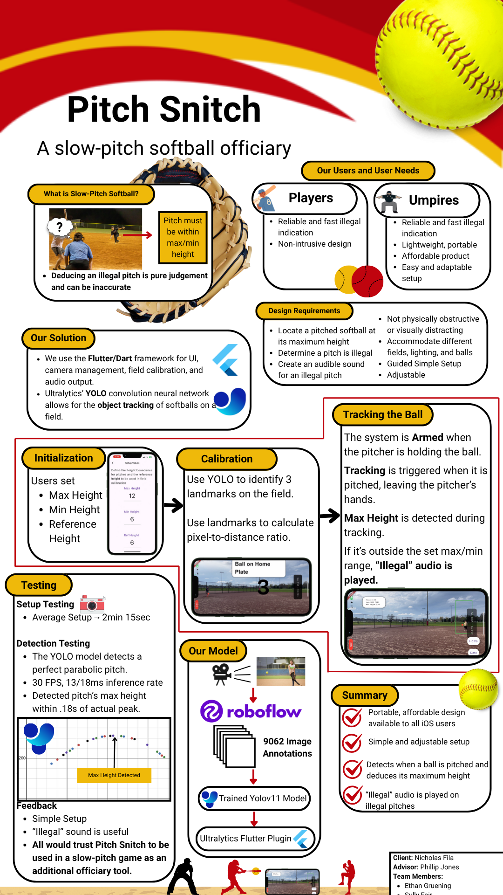

# Flutter App Setup Guide

This guide walks you through installing Flutter, setting up Android and iOS environments, and running a Flutter app on **Android** (emulator or physical device) and **iOS** (physical device).

---

## **1. Install Flutter**

### **Windows - Physical and Emulated Device Testing/Development**
1. Download Flutter from the official site: [Flutter SDK](https://flutter.dev/docs/get-started/install)
2. Extract the Flutter SDK to a preferred location (e.g., `C:\flutter` on Windows)
3. Add Flutter to the system path:
  - Windows: Add `C:\flutter\bin` to `Environment Variables`
4. Restart your terminal
5. Download Android Studio from the official site: [Android Studio Download](https://https://developer.android.com/studio)
6. Install the Android Studio Dart and Flutter plugins from Settings --> Plugins
7. For Emulating a Device:
  - Set up a device in the Device Manager tab
  - Edit the device and set `Graphics = Software`
  - Set up the camera environment by going into `Advanced Settings` and set `Front Camera = Emulated` and `Back Camera = Emulated`
8. For Physical Device:
  - Enable **Developer Mode** on your Android phone:
  - Go to **Settings > About phone**
  - Tap **Build number** **7 times** to enable Developer Mode
  - In **Developer Options**, enable **USB Debugging**
  - Connect your Android device via USB
  - Run:
      ```sh
      flutter devices
      ```
    Your device should appear in the list.

**Common Windows Issues:**
- If your device becomes unresponsive with errors about `*.lock files` delete all files ending in `.lock` in your Android Studio installation location within the `avd` directory
- When running the app, if the installation fails due to storage limitations, select to edit your emulated device and select the `Wipe Data` option to clear the device's app storage.
- If Android Studio is unable to run Dart, end all tasks in Task Manager using `dart`. Some programs can be left dangling.

### **MacOS - Physical Device Testing/Development**
1. 1. Install **Xcode** from the App Store
2. Open **Xcode > Preferences > Accounts**
3. Sign in with your Apple ID (free account works, but requires manual app signing)
4. Connect your iPhone via USB
5. Trust the device when prompted
6. Install **Flutter** using Homebrew:
   ```sh
   brew install flutter
   ```
7. Ensure **Xcode** is installed via the App Store
8. Install CocoaPods for iOS dependencies:
   ```sh
   sudo gem install cocoapods
   ```
9. Run:
   ```sh
   flutter devices
   ```
   Your iPhone should appear in the list.
10. Open **ios/Runner.xcworkspace** in Xcode
11. Select your **development team** under **Signing & Capabilities**
12. Run the app in Xcode or via:
    ```sh
    flutter run
    ```
**Common iOS Issues**
- **iOS Signing Issues?**
    - Ensure Xcode is signed with a valid development team in **Signing & Capabilities**.

---

## **2. Verify Installation**
Run the following command to check if Flutter is set up correctly:
```sh
flutter doctor
```
If there are any missing dependencies, follow the instructions provided by `flutter doctor`.

---

## **3. Setup Flutter Project**

Navigate to your project directory and run:
```sh
flutter clean
flutter pub get
```
If `flutter pub get` fails, run it again:
```sh
flutter pub get
```

---

## **4. Running the Flutter App**

To start the app on an **Android emulator, physical Android device, or iOS device**, run:
```sh
flutter run
```
If running on iOS and encountering permission errors, try:
```sh
cd ios
pod install
cd ..
flutter run
```

---

## **Troubleshooting**
- **App not detecting device?**
  - Run `flutter devices` to confirm the device is recognized.
  - Ensure USB debugging (Android) or proper provisioning (iOS) is set up.
- **Errors during `flutter pub get`?**
  - Run `flutter clean` and try `flutter pub get` twice.
- **Dependency Errors**
  - Run `flutter clean` and try `flutter pub get` twice.
- **Camera Not Working?**
  - Ensure camera permissions are granted in the device settings.
- **Model Loading Errors?**
  - Verify the model file paths in the `assets/` directory.
- **iOS Build Issues?**
  - Ensure CocoaPods dependencies are installed and Xcode signing is configured.


---
## **5. Folder Structure Overview**


### **Flutter Directory - `softball_tracker`**
- **`.vscode/`**: Contains Visual Studio Code settings for the project.
- **`android/`**: Contains Android-specific files, including Gradle build scripts and native code.
- **`ios/`**: Contains iOS-specific files, including Xcode project files and native code.
- **`lib/`**: The main directory for Flutter/Dart code.
  - **`views/`**: Contains UI screens such as `yolo_screen.dart` and `setup_camera_capture_screen.dart`.
  - **`utils/`**: Utility functions and constants used across the app.
  - **`widgets/`**: Reusable Flutter widgets.
- **`assets/`**: Contains images, videos, and other static resources.
- - **`test/`**: Contains unit and widget tests for the app.

- **`ultralytics_yolo/`**: A custom Flutter plugin for YOLO-based object detection.
  - **`ultralytics_yolo/lib/`**: Contains the Dart interface for the plugin.
      - **`ultralytics_yolo_platform_interface.dart`**: Defines the platform interface for the plugin.
      - **`ultralytics_yolo_platform_channel.dart`**: Implements the platform interface using method channels.
      - **`camera_preview/`**: Contains classes for managing the camera preview and bounding box overlays.
  - **`ultralytics_yolo/android/`**: Contains Android-specific implementation.
      - **`MethodCallHandler.java`**: Handles method calls from Dart and communicates with the Android CameraX API and TensorFlow Lite.
  - **`ultralytics_yolo/ios/`**: Contains iOS-specific implementation.
      - **`SwiftUltralyticsYoloPlugin.swift`**: Handles method calls from Dart and communicates with the iOS AVFoundation and CoreML frameworks.

---
### **Root Directory**
- **Software Architecture Diagram `SW_Architecture_Diagram.pdf`**
  - A modular diagram showing the file, dependency, and data connections of the Flutter application's software components.
- **Poster - `PitchSnitchPoster.png`**
  - A graphic overview our project's requirements, solution, application UI walkthrough, and testing.
- **Design Presentation - `SlowPitchDesignPresentation.pdf`**
    - The `SlowPitchDesignPresentation.pdf` presentation summarizes this project’s application, motives, and development practices. The presentation document is a reduced version of the Design Document. The contents of the presentation are listed below.
        - Project Overview
            - What is Slow-Pitch softball?
            - Why is our application needed?
        - User Needs
            - Who are our users?
            - What do they expect and need from our application?
        - Project Requirements
            - What are the fundamental standards our project must meet?
        - Ethical Requirements
            - What does our team believe our ethical standards must be during development?
        - Project Planning
            - What management style does our team use?
            - Task Decomposition graph to allocate tasks to complete our main objective.
            - Gantt Chart showing our timeline of goals throughout the project.
        - Design
            - Technical Needs
                - Flutter Development Framework
                - Ultralytics YOLO
            - Our Yolo Model
                - The collection, annotation and augmentation of our data used in the model.
                - The training specifications used for our YOLO model.
                - The integration of our YOLO model into our application.
            - Height Determination Design
                - How do we calculate the height of a ball using identified points?
            - Armed System Design
                - How can we identify and track only pitched softballs?
            - Module Design
        - Testing
            - Model Testing
                - How do we verify that our model can accurately and efficiently detect a ball throughout a pitch?
            - User Testing
                - User feedback and testing of the tracking, UI, and setup process.
        - Future Development Recommendations
---


## **6. Method Channels**

The plugin uses method channels to communicate between Flutter and the native platforms.

### **Android**
- **Method Channel**: `"ultralytics_yolo"`
  - **Implemented in**: [`UltralyticsYoloPlugin.java`](softball_tracker/ultralytics_yolo/android/src/main/java/com/ultralytics/ultralytics_yolo/UltralyticsYoloPlugin.java)
  - **Key Methods**:
    - `loadModel`: Loads the YOLO model for object detection.
    - `setConfidenceThreshold`: Sets the confidence threshold for detections.
    - `setIouThreshold`: Sets the Intersection over Union (IoU) threshold.
    - `startCamera`: Starts the camera preview.
    - `stopCamera`: Stops the camera preview.

### **iOS**
- **Method Channel**: `"ultralytics_yolo"`
  - **Implemented in**: [`SwiftUltralyticsYoloPlugin.swift`](softball_tracker/ultralytics_yolo/ios/Classes/SwiftUltralyticsYoloPlugin.swift)
  - **Key Methods**:
    - `loadModel`: Loads the YOLO model using CoreML.
    - `setConfidenceThreshold`: Sets the confidence threshold for detections.
    - `setIouThreshold`: Sets the IoU threshold.
    - `startCamera`: Starts the camera preview using AVFoundation.
    - `stopCamera`: Stops the camera preview.

---

## **7. Notes on YOLO Integration**

- The YOLO models are stored in the `assets/` directory and loaded dynamically at runtime.
- The plugin supports both CPU and GPU inference for better performance.
- Bounding boxes and detection results are rendered on the Flutter UI using custom painters.

---

## **8. Deploying Prebuilt App to iPhone**

- At the root of the `softball_tracker` folder you can locate the prebuilt app named `softball_tracker.ipa`
- Download the file to your Mac 
- Open xcode to a blank project
- Connect your device to your computer
- Open the `Devices and Simulator` window (window > devices and simulators)
- Under the section `Installed apps` hit the `+` at the bottom
- Locate your downloaded `softball_tracker.ipa` and select it
- On your iPhone navigate to `Settings > General > VPN & Device Management` and trust the app developer
- Open the app 

---

## Contact Information
### Ethan Gruening
Please contact me by email:
[ethangruening@gmail.com](mailto:ethangruening@gmail.com)

## Other contributors
- Andrew Vick
- Sully Fair


